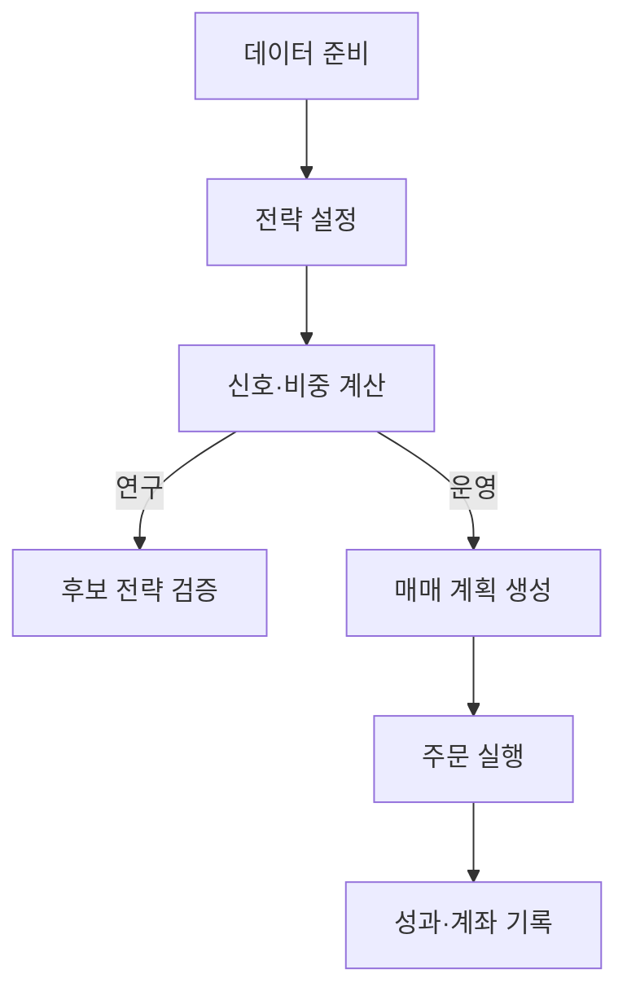

# 퀀트 리서치 & 자동매매 시스템

전략 아이디어를 데이터 수집, 신호 계산, 검증, 목표 비중 산출, 실계좌 자동매매까지 하나의 흐름으로 연결한 퀀트 트레이딩 시스템입니다.

> **공개용 포트폴리오 저장소**
>
> 시스템의 구조와 구현 방식을 확인할 수 있도록 선별한 공개본입니다. 실제 운용 전략, 활성 프로필, 계좌 정보, 원천 데이터, 주문·체결 기록은 포함하지 않습니다. 공개된 설정은 구조 설명과 재현 가능한 예시를 위한 자료이며 현재 운용 상태를 나타내지 않습니다.

[기능 목록](notes/feature_inventory.md) · [설정 레퍼런스](notes/config_reference_v2.md) · [LLM 워크플로우](notes/llm_assisted_workflow.md) · [대표 전략 사례](notes/strategy_examples.md)

## 전체 구조

## 시스템 구성

| 구성 요소 | 역할 |
| --- | --- |
| 데이터 준비 | 시장 가격, 거래량, 거래대금, 환율, 종목 메타데이터를 수집하고 전략 계산용 캐시로 정리 |
| 전략 설정 | 설정 파일로 유니버스, 신호, 필터, 비중 산출 방식을 정의 |
| 신호·비중 계산 | 전략 설정을 데이터에 적용해 후보 자산과 목표 비중 생성 |
| 후보 전략 검증 | 그리드 탐색, walk-forward, PBO, SPA, StepM, 낙폭과 회복기간 분석으로 후보 전략 점검 |
| 매매 계획 생성 | 최신 목표 비중과 실제 계좌 보유를 비교해 주문 수량 계산 |
| 주문 실행 | preview 또는 live 모드로 주문 제출과 체결 확인 처리 |
| 성과·계좌 기록 | 실행 결과와 계좌 스냅샷을 저장하고 주요 이벤트를 알림으로 전달 |

## 더 보기

| 문서 | 설명 |
| --- | --- |
| [기능 목록](notes/feature_inventory.md) | 구현된 연구·검증·라이브 기능 |
| [설정 파일 레퍼런스](notes/config_reference_v2.md) | 전략 설정 옵션 |
| [LLM 워크플로우](notes/llm_assisted_workflow.md) | LLM과 함께 전략을 실험하는 방식 |
| [대표 전략 사례](notes/strategy_examples.md) | 대표 전략의 성과와 검증 사례 |
