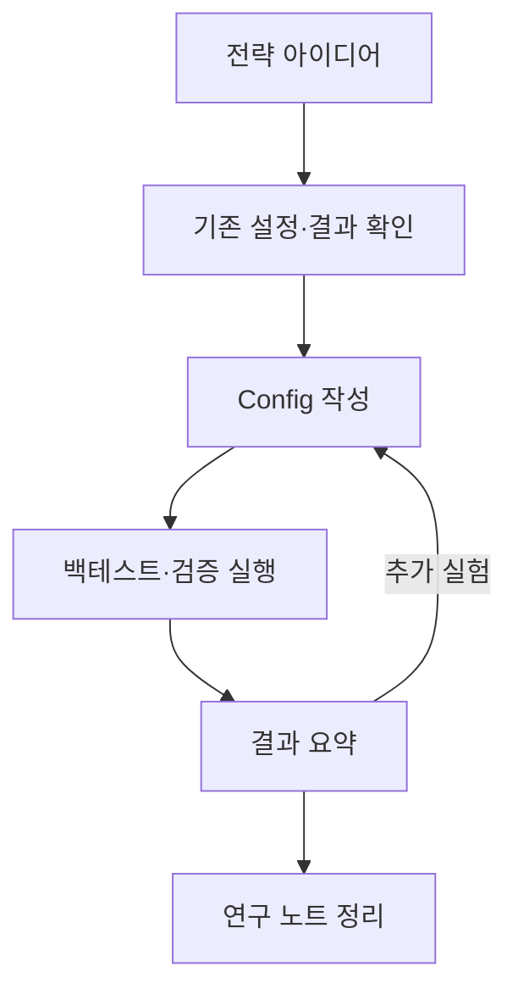

# LLM 워크플로우

전략 아이디어를 config 작성, 검증 실행, 결과 해석, 연구 노트로 이어가는 과정에 파일 수정이 가능한 LLM을 사용합니다. 사람은 전략 방향과 판단 기준을 제시하고, LLM은 기존 설정, 결과 파일, 문서를 확인해 실험 가능한 형태로 정리합니다.

## 사용 방식

| 단계 | 역할 |
| --- | --- |
| 아이디어 제시 | 사용자가 전략 방향, 제약, 선호 지표를 설명합니다. |
| 기존 구조 확인 | LLM이 기존 config, transform, 결과 CSV, 노트를 확인합니다. |
| 설정 작성 | 가능한 경우 기존 v2 config와 transform 조합으로 실험을 구성합니다. |
| 결과 해석 | 성과, 낙폭, 회복기간, 약세 구간, 검증 결과를 비교합니다. |
| 기록 | 채택 근거, 보류 이유, 추가 실험 방향을 노트로 남깁니다. |

새 transform이나 엔진 수정이 필요한 경우에는 구현 전에 변경 필요성, 복잡도, 기존 전략 영향 범위를 먼저 확인합니다.

나중에 실제 대화 화면, config 변경 diff, 결과 요약 화면을 추가해 실사용 예시를 보강할 예정입니다.
